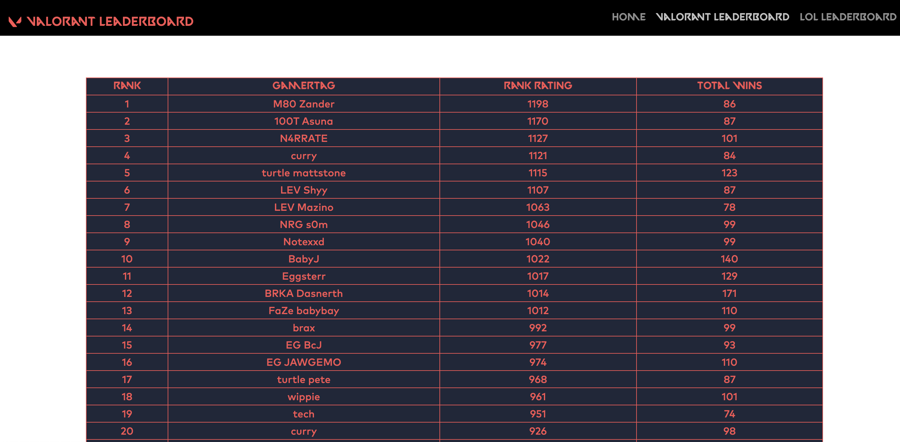
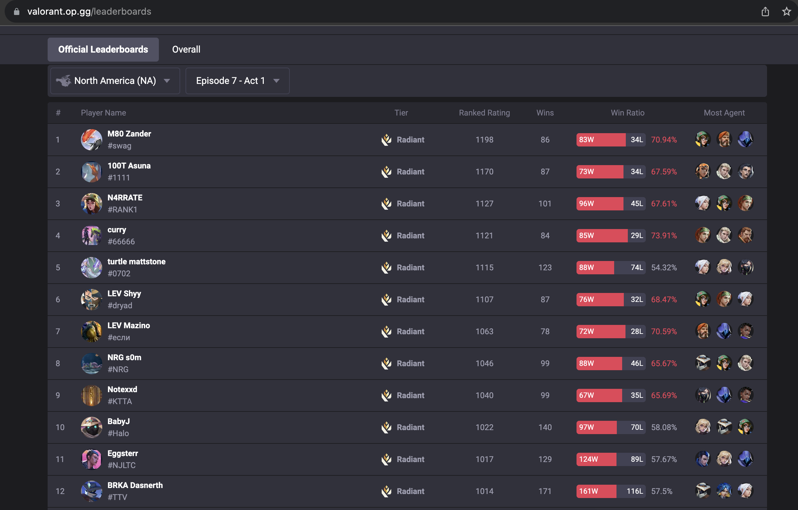
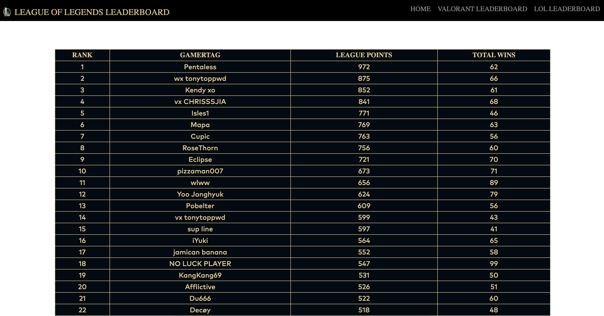
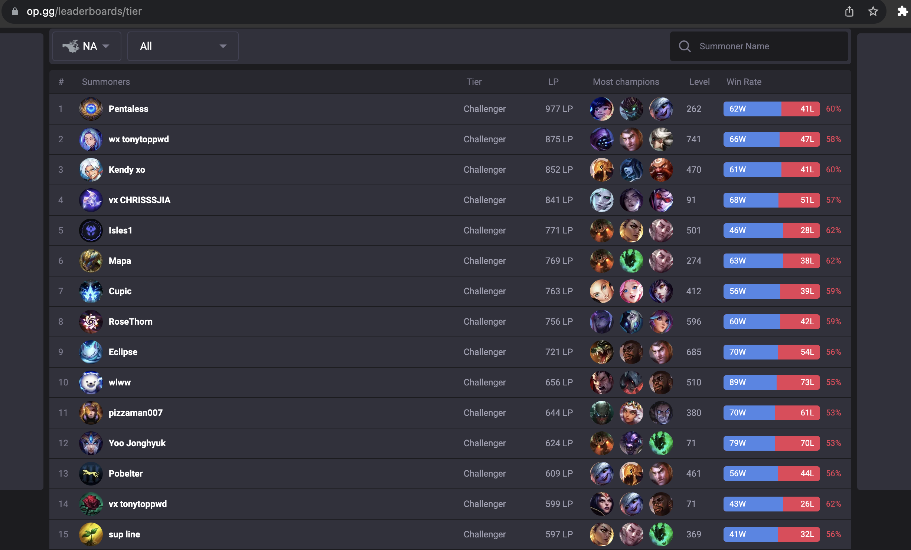

# Riot Games Leaderboard app (Cloud Run)

Daniel Gregorio-Torres

11/22 - 12/22

Personal Project

## Description

RUNNING APP USING GOOGLE CLOUD RUN

The purpose of this small web app is to demonstrate some of the information that can be obtained using the https://developer.riotgames.com/ Free API. This application displays competitive play information for 2 games developed by Riot Games. One game includes Valorant, where the competitive/ ranked leaderboard is displayed with the rank, gamertag, rank rating, and total wins for the top 100 players is displayed. The other game is League of Legends, where the rank, gamertag, league points, and total wins for the top challenger(best rank) players is displayed.

## Navigation

- [Setup](#setup)
- [Deployment](#deployment)
- [Tests](#tests)
- [Previews](#previews)

## Setup

1. Create a service account in google cloud and give it the `Cloud Datastore User` role

1. Open google cloud shell and go to the directory with your source code

1. Run the following command

```shell
gcloud builds submit --timeout=900 --tag gcr.io/${GOOGLE_CLOUD_PROJECT}/<imgName>
```

- This uploads the Dockerfile and application source files to build a container image
- image is stored in the container registry using the image name entered for `<imgName>` above
- There is a timeout value since this might take over the 10 minute default setting

## Deployment

1. Run the following command

```shell
gcloud run deploy <projectName> \
--image gcr.io/${GOOGLE_CLOUD_PROJECT}/<imgName> \
--service-account <serviceAccount>@${GOOGLE_CLOUD_PROJECT}.iam.gserviceaccount.com --set-env-vars API_KEY=<YOUR API KEY>, ACT_ID=<VALORANT ACT ID YOU WANT>
```

- First line calls cloud run to deploy a container named <projectName>
- Second line references the image we created previously
- Third sets the service account to the account we made with ‘Cloud Datastore User’ role
- The last flag sets environment variables named API key, and ACT_ID

For the ACT_ID you can use the following route to get the act id you would like to get information from. https://na.api.riotgames.com/val/status/v1/platform-data?api_key=<Your_API_KEY>

2. Specify a region

- Enter the region to host your app

3. Allow Unauthenticated Invocations

- Type in `y`

4. Your app will be hosted on the `Service URL` provided

## Tests

The application comes with the following tests:

1. Test for the home page route ('/')
1. Test for the 'valLeaders' route ('/valLeaders')
1. Test for the 'lolLeaders' route ('/lolLeaders')

In order to run the test the enter the following command:

```shell
pytest
```

## Previews

###### Valorant Leaderboard From App



###### Valorant Leaderboard From [op.gg](https://valorant.op.gg/leaderboards)



###### Valorant Leaderboard From App



###### Valorant Leaderboard From [op.gg](https://www.op.gg/leaderboards/tier)


